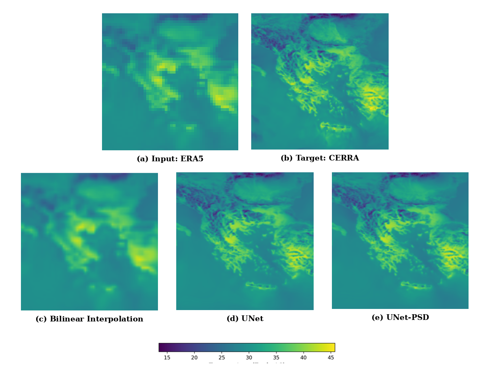

# ERA5 to CERRA via U-Net

### Temperature super-resolution

### U-Net architecture

### From ERA5 to CERRA

### Over the Eastern Mediterranean

### Temporal resolution of 3 hours

<p align="center">
  
</p>

---

# Installation

This project is designed to run on **Kaggle**.

Clone the repository

```bash
git clone [https://github.com/<your_username>/<repository_name>.git](https://github.com/mar-agal/ERA5TOCERRA)
%cd /kaggle/working/ERA5TOCERRA
```

Install the required dependency

```bash
pip install lightning
```

Run the training

```bash
python train_unet.py
```

Evaluate the trained model

```bash
python test_unet.py
```

---

# Project Structure

This repository contains several key components that are integral to the project. Below is an overview of each file and its purpose.

## train_unet.py

**Description:**

Main training script used in this project.

Supports both standard U-Net training using the Mean Squared Error (MSE) loss and training with an additional Power Spectral Density (PSD) loss. The desired training mode can be selected through the configuration parameters.

---
## train_unet_psd.py

**Description:**

Trains the pretrained U-Net model using Smooth L1 (Huber) loss together with an additional Power Spectral Density (PSD) loss.

The model is initialized from the pretrained U-Net weights trained with MSE.

---

## test_interpolation.py

**Description**

Applies bilinear interpolation to the ERA5 inputs and generates the baseline predictions.

---

## test_unet.py

**Description**

Generates predictions using the baseline U-Net model and computes evaluation metrics and diagnostic plots.

---

## test_unet_all.py

**Description**

Generates predictions using both the baseline U-Net and the U-Net-PSD models, and computes evaluation metrics and comparison plots.

---

## src/data_module.py

**Description**

PyTorch Lightning DataModule responsible for loading the ERA5 and CERRA datasets during training and evaluation.

---

## src/dataset.py

**Description**

Dataset implementation used for loading paired ERA5 and CERRA samples.

---

## src/losses.py

**Description**

Contains the loss functions used during model optimization.

---

## src/metrics.py

**Description**

Implements the evaluation metrics used throughout the experiments.

---

## src/plots.py

**Description**

Utilities used for plotting predictions, comparisons and evaluation figures (psd curves, frequency distribution).

---

## src/models/unet/

### unet_architecture.py

**Description**

Defines the U-Net architecture used throughout this project.

### unet_lightning.py

**Description**

PyTorch Lightning implementation of the U-Net training pipeline.

### unet_psd_h_lightning.py

**Description**

Lightning module implementing the U-Net model with Smooth L1 (Huber) and Power Spectral Density (PSD) losses.

---

## src/models/unet_gan/

### gan_lightning.py

### patchgan_discriminator.py

**Description**

Contains an experimental GAN-based implementation for climate super-resolution.

These files are included for future development but **were not used in the experiments presented in this repository**.

---

## data_pipeline/

The complete preprocessing workflow is documented in

```
data_pipeline/README.md
```

It includes:

- ERA5 and CERRA data acquisition
- reprojection onto a common grid
- temporal train / validation / test split
- normalization statistics extraction

---

# Data Availability

The processed datasets used in this project are freely available as Kaggle Datasets.

### Training Datasets

- **ERA5 Training Dataset:** [Kaggle Dataset](https://www.kaggle.com/datasets/mariaagalioti/era5-train)
- **CERRA Training Dataset:** [Kaggle Dataset](https://www.kaggle.com/datasets/mariaagalioti/cerra-train)

### Validation and Test Datasets

The validation and test datasets for both ERA5 and CERRA are available in the following **[Kaggle Dataset](https://www.kaggle.com/datasets/mariaagalioti/dataset)**.

### Static Data

The static variables used during training (e.g., land-sea mask and orography) are available in the following **[Kaggle Dataset](https://www.kaggle.com/datasets/mariaagalioti/static-data)**.

### Model Weights

The trained model weights are available as Kaggle Datasets.

- **U-Net (MSE):** [Kaggle Dataset](https://www.kaggle.com/datasets/mariaagalioti/wieghts)
- **U-Net (MSE + PSD):** [Kaggle Dataset](https://www.kaggle.com/datasets/mariaagalioti/weights-unet-psd-loss)

### Normalization Statistics

The normalization statistics used during training are available in the following **[Kaggle Dataset](https://www.kaggle.com/datasets/mariaagalioti/stats-era-cerra)**.

---

The raw climate data used in this project is available from the Copernicus Climate Data Store (CDS):

- **ERA5:** [Copernicus Climate Data Store](https://cds.climate.copernicus.eu/datasets/reanalysis-era5-single-levels)
- **CERRA:** [Copernicus Climate Data Store](https://cds.climate.copernicus.eu/datasets/reanalysis-cerra-single-levels)


---


# Environment

The experiments were conducted using Kaggle Notebooks with:

- Python 3.12.13
- PyTorch
- PyTorch Lightning
- NVIDIA Tesla T4 GPU
